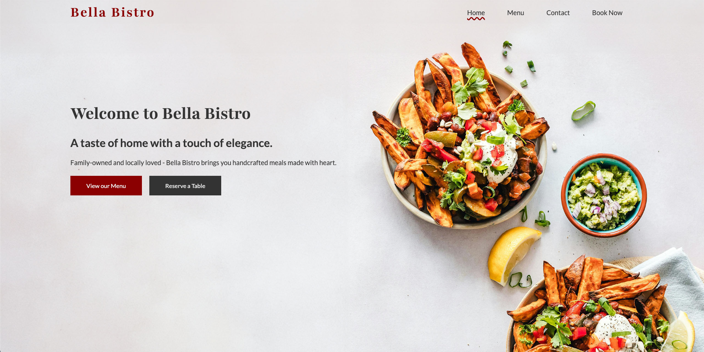
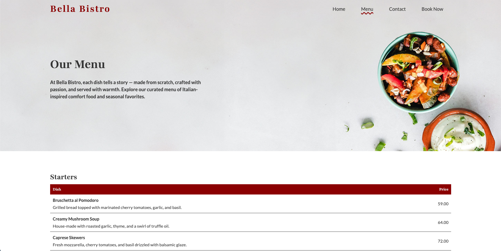
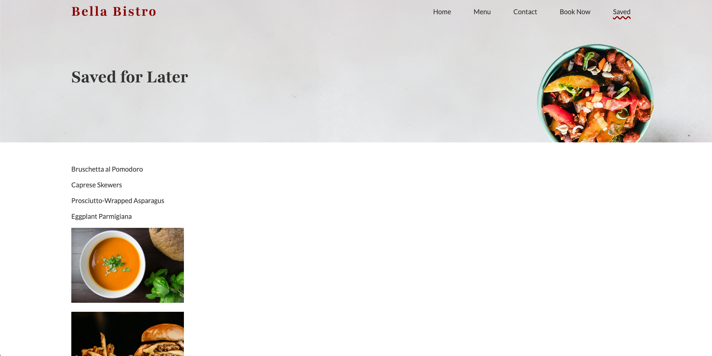
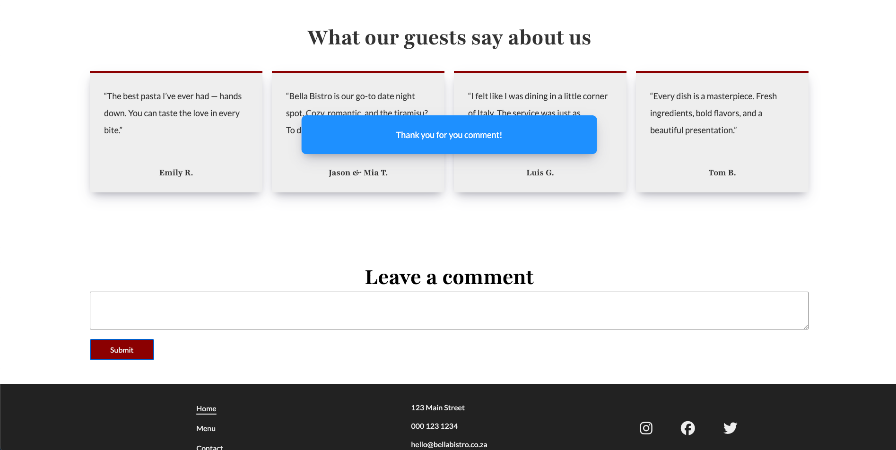

# Bella Bistro - HTML, SASS, and JavaScript

Bella Bistro is a responsive mock website for a fictional restaurant. This version includes enhanced interactivity using JavaScript and jQuery. It features dynamic saving of content, a comment system, likes, animations, and modal popups — all built on top of the original HTML and SASS structure. The project showcases front-end development and user interaction using client-side storage and DOM manipulation.

## Table of Contents

- [Overview](#overview)
- [Installation](#installation)
- [Usage](#usage)
- [Screenshots](#screenshots)
- [Credits](#credits)

## Overview

This updated version of Bella Bistro includes all the original static pages:

- **Home Page** — Introduction and key highlights of Bella Bistro
- **Menu Page** — Full menu categorized by meal type
- **Contact Page** — A contact form and address details
- **Reservations Page** — A form to book a table

**New Features:**

- **Saved Page** — View saved items (menu items or images)
- **Save for Later** — Allows saving images or menu items to session storage
- **Like Feature** — Like any image in the gallery
- **Comment Form** — Leave feedback or comments
- **Modal Popup** — Displays a thank you message upon comment submission
- **Save Alert** — Shows an alert with the number of saved items
- **Button Animations** — Smooth animations using jQuery

Visit the live site here:  
👉 [Bella Bistro Live Demo](https://codebyxander.github.io/Bella-Bistro---HTML-SASS-JavaScript-Project/)

## Installation

To run this project locally:

```bash
git clone https://github.com/CodeByXander/Bella-Bistro---HTML-SASS-JavaScript-Project.git
cd Bella-Bistro---HTML-SASS-JavaScript-Project
```

You can now open the `index.html` file in your browser.

## Usage

This project is a static website with JavaScript enhancements. There is no backend or server setup required. Once you’ve cloned the repository, simply open the `index.html` file in any modern browser.

### Interactive Features:

- **Save Items**: Click a save button on menu items or images to store them in session storage.
- **View Saved Items**: Navigate to the "Saved" page to see what you've saved.
- **Like Images**: Click the heart icon on images to like them.
- **Leave a Comment**: Submit a comment via the form and see a confirmation modal.
- **Animations and Alerts**: Experience smooth jQuery-powered animations and user feedback alerts.

## Screenshots

Below are screenshots of the Bella Bistro site with JavaScript features:

### Home Page



### Menu Page



### Saved Page



### Comment Modal



## Credits

This project was designed and developed entirely by:

- [Xander](https://github.com/codebyxander)
